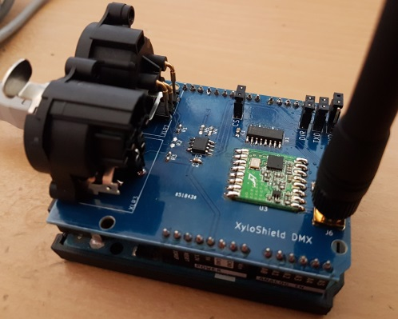

XyloShield DMX
==============

The XyloShield DMX is a simple Shield for Arduinos like the Uno that has two functions: On the one hand, it hosts a RFM26W radio module and the necessary level shifting to use it with a 5 V Arduino. On the other hand (and because enough space was left...), it contains an RDM capable DMX-512 transceiver.
Both functions are completely separate, so the board can also be populated only partially to support the function you want.
The board was designed using KiCad (my first project with that package, so be warned!).

There is also an Arduino library for the shield: XyloLibrary (https://github.com/StefanKrupop/XyloLibrary)

Radio
-----

The main functionality (and where its name comes from) of the board is to be able to send radio packets to "Xylobands" LED bracelets in order to study the proprietary protocol used by them. An 868 MHz RFM26W radio module was selected as it uses a compatible radio controller to that one on the Xylobands.
As this part is 3.3 V only, a 74HC4050 was added as a level shifter for the 5 V Arduino.
The chip can be disabled by removing the "CS" jumper, which disconnects the Arduino pin from the shield. A pull-up resistor then keeps the radio module disabled.

The radio module uses SPI and is connected to the following Arduino pins:
D3 <- nIRQ
D4 -> SDN
D10 -> nSEL (/CS)
MISO <- SDO
MOSI -> SDI
SCK -> SCK

The radio part is comprised of the following components (that can be left unpopulated if you do not need this functionality):
C1, C3, J6, J7, R5, U1, U3

DMX-512
-------

The DMX part can be used to build a DMX-512 sender, receiver or an RDM capable device. It uses a standard RS485 transceiver and a "Line Bias Network" to be able to support RDM.
If the DMX part should be used as a receiver (with or without RDM), resistors R1 to R3 should be left unpopulated, as the Line Bias Network should only be used by a DMX sender.
Jumpers J3 to J5 can be used to disconnect the Arduino pins from the shield.

**ATTENTION**: When using e.g. the Arduino Uno, J5 needs to be open to be able to upload a sketch!

The DMX part uses the UART and is connected to the following Arduino pins:
D0 <- RXD
D1 -> TXD
D2 -> Receive/Transmit select

The DMX part is comprised of the following components (that can be left unpopulated if you do not need this functionality):
C2, J1, J2, J3, J4, J5, R1, R2, R3, R4, U2

BOM
---

| Part      | Value                      | Conrad Electronics order nr. | 
|-----------|----------------------------|------------------------------|
| C1-C3     | 100 nF, 25 V, 0603         | 1279656                      |
| J1        | Neutrik NC3MAAH            | 651105                       |
| J2        | Neutrik NC3FAAH1           | 651095                       |
| J3-J5, J7 | 2,54 mm pin header         | 1390109                      |
| J6        | RP-SMA connector           | 1565639                      |
| R1, R3    | 562 Ohms, 0603             | 437643                       |
| R2        | 133 Ohms, 0603             | 433625                       |
| R4, R5    | 10 k, 0603                 | 1208549                      |
| U1        | 74HC4050, SOIC-16          | 1015779                      |
| U2        | SN75176, SOIC-8            | 1048058                      |
| U3        | RFM26W                     | -                            |
| -         | Matching antenna           | 673977                       |
| -         | 32 pins 2,54 mm pin header | 1390109                      |
| -         | 2x3 pins socket            | 1492284                      |
| -         | 4 jumper caps              | 1560848                      |